<!DOCTYPE html>
<html class="no-js" lang="en">
  <head>
  </head>
  <body>
    

      
 
        

          <h1>RS-Decoder
                for Radiosonde's in Ubuntu Linux. </h1>
          
 
          

          
 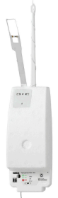 
            Vaisala RS-41 
          

          
A radiosonde is a
            small weather sensor package that is typically attached to a
            weather balloon.  
            As it rises into the atmosphere it measures parameters such
            as temperature, humidity, pressure, GPS location etc, and
            transmits this data back down to a receiver base station
            using a radio signal. 
            Zilog's&nbsp;<a rel="noopener"
              href="https://github.com/rs1729/RS" target="_blank"
              style="user-select: auto !important; margin: 0px; padding:
              0px; font-size: 15px; vertical-align: baseline;
              background: 0px 0px; color: rgb(46, 110, 176);
              text-decoration: underline; -webkit-tap-highlight-color:
              rgb(0, 0, 0);">RS</a>-Decoders is a free
            open source radiosonde decoder for Linux and it supports a
            wide range of radiosonde protocols.  
            Together with an RTL-SDR it is possible to receive
            radiosonde signals, and decode them using RS-Decoders.

          
This tutorial
            covers some tricky points like setting up audio piping in
            Linux CubicSDR or GQRX , and getting the GPS data into a
            virtual COM port to use with FoxtrotGPS. 
          

           
          

            
Contents

            <ul>
              <li> 1Overview
                <ul>
                  <li>1.1&nbsp; <a href="#Dependencies_">Dependencies</a>
                  </li>
                  <li>1.2&nbsp; <a href="#Compile_Decoders_">Compile
                        Decoders</a> </li>
                  <li>1.3&nbsp; <a
                        href="#Scripts_Setting_up_Virtual_ports">Scripts,
                        Virtual Ports</a> 
                    </li>
                  <li>1.4&nbsp; <a href="#SDR_Radio_programs_">SDR
                      Radio Programs</a></li>
                  <li>1.5&nbsp; <a href="#Install_Driver_">Install
                      Driver</a> 
                  </li>
                  <li>1.6&nbsp; <a href="#Virtual_Audio_setup_">Virtual
                        Audio Setup</a> </li>
                  <li>1.7&nbsp; <a href="#GPSD_Setup_">GPSD Setup</a> 
                    </li>
                  <li>1.8&nbsp; <a href="#Get_it_all_Running_">Get
                      it all running</a><a
                      href="#Zilog_DFM_Decoder_Scripts_"> 
                    </a></li>
                </ul>
              </li>
            </ul>
          

           
          
 

          <h2>Dependencies 
          </h2>
          
&nbsp;&nbsp;&nbsp;&nbsp;&nbsp;&nbsp;&nbsp;
             
            &nbsp;&nbsp;&nbsp;&nbsp;&nbsp; Intermet I-Met 1AB
            &nbsp;&nbsp;&nbsp;&nbsp;&nbsp;&nbsp;&nbsp;&nbsp;&nbsp;&nbsp;&nbsp;&nbsp;
             
          

          
Make sure you have
            sox, perl, gpsd, socat and pulseaudio installed.

          
sudo apt-get
            install sox

          
sudo apt-get
            install perl

          
sudo apt-get
            install socat

          
sudo apt-get
            install pulseaudio

          
sudo apt-get
            install pavucontrol

          
sudo apt-get
            install gpsd gpsd-clients

          <h2>Compile Decoders 
          </h2>
          
&nbsp;&nbsp;&nbsp; &nbsp; &nbsp;
            &nbsp; &nbsp; &nbsp; &nbsp;&nbsp; &nbsp;  
            &nbsp;&nbsp;&nbsp;&nbsp;&nbsp;&nbsp;&nbsp;&nbsp;&nbsp;
            Vaisala RS-41&nbsp; SGP
            &nbsp;&nbsp;&nbsp;&nbsp;&nbsp;&nbsp;&nbsp;&nbsp;&nbsp;&nbsp;&nbsp;&nbsp;&nbsp;&nbsp;&nbsp;&nbsp;&nbsp;
             
          

           
          <a href="img/files.zip"><b>Download Decoders and Script</b></a> 
           
          <a href="http://happysat.nl/RS/Ubuntu/" target="_blank">Updated
            compiled RS-Decoders are overhere.</a> 
           
          
 <a href="#Scripts_Setting_up_Virtual_ports">And skip this
              part.</a> 
             
          

          <b>Or create manually</b> 
          
Download the
            decoders or just do a git clone

          
wget&nbsp;<a
              href="https://github.com/rs1729/RS/archive/master.zip"
              target="_blank">https://github.com/rs1729/RS/archive/master.zip</a>

          
git clone
            git://github.com/rs1729/RS.git 
          

          
Compile decoders
            DFM-09/RS-41/M10, M20 or any other you need.

          
cd RS/demod/mod 
            gcc -c demod_mod.c -w -O3 
            gcc -c bch_ecc_mod.c -w -O3

          
echo "Compiling
            Mod RS41"  
            gcc rs41mod.c demod_mod.o bch_ecc_mod.o -lm -O3 -o rs41mod
            -w 
             
            echo "Compiling Mod DFM09"  
            gcc dfm09mod.c demod_mod.o -lm -O3 -o dfm09mod -w 
             
            echo "Compiling Mod M10/20"  
            gcc m10mod.c demod_mod.o -lm -O3 -o m10mod -w 
            gcc mXXmod.c demod_mod.o -lm -O3 -o mXXmod -w 
             
          

          
Put compiled
            rs41mod and dfm09mod files in a folder decoders or smth. 
            <b>Also put pos2nmea.pl (NMEA perl script) from folder
              RS/tools in the folder!</b> 
          

          <h2>Scripts,
            Setting up Virtual ports 
          </h2>
          
&nbsp;&nbsp;&nbsp;&nbsp;&nbsp;&nbsp;&nbsp;
             
            &nbsp;&nbsp;&nbsp; &nbsp; &nbsp; &nbsp; &nbsp; &nbsp;
            Vaisala RS-92
            &nbsp;&nbsp;&nbsp;&nbsp;&nbsp;&nbsp;&nbsp;&nbsp;&nbsp;&nbsp;&nbsp;&nbsp;
             
          

          We need to create a few scripts..
          
<b>Example DFM:</b>

          
Create new file
            dfm.sh with content:

          
#!/bin/bash 
            echo "DFM Log" &gt; /home/decoders/dfm09_`date
            +%Y%m%d%H`Z.txt 
            sox -t pulseaudio default -t wav - 2&gt;/dev/null |
            ./dfm09mod --dist -vv --ptu --auto 2&gt;&amp;1 | tee -a
            /home/decoders/dfm09_`date +%Y%m%d%H`Z.txt | ./pos2nmea.pl
            &gt; /tmp/virtualcom0 
            exit 

          
<b>Save it</b>. 
             
          

          
<b>Making Virtual
              COM Port.</b>

          
Create new file
            vp.sh with content:

          
#!/bin/bash 
             
            echo "Creating Virtual Com Port: 0 and 1" 
             
            vcpath='/tmp' 
            socat -d -d pty,link=${vcpath}/virtualcom0,raw,echo=0
            pty,link=${vcpath}/virtualcom1,raw,b4800,echo=0 &amp; 
            socatpid=$! 
            echo "socat pid=$socatpid" 
            sleep 2 
             
            trap "kill $socatpid &amp;&gt;/dev/null; exit 0" INT TERM
            EXIT 
             
            echo "Start GPSD on Virtual Com Ports" 
            killall -q gpsd 
            gpsd -D2 -b -n -N ${vcpath}/virtualcom1

          
<b>Save it.</b>

          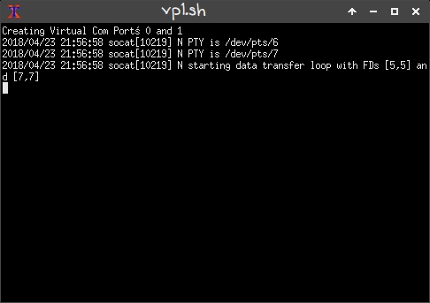 
           
          
<b>Create new file
              dfm_gps.sh with content:</b>

          
#!/bin/sh

          
xfce4-terminal -T
            vp -e ./vp.sh --tab -T dfm -e ./dfm.sh

          
<b>Save i</b><b>t.</b>

           
          
<b>Create new file
              rs41.sh with content:</b>

          
#!/bin/bash 
            sleep 1 
            sox -t pulseaudio default -t wav - 2&gt;/dev/null |
            ./rs41mod --ecc2 --crc -vx --ptu 2&gt;&amp;1 | tee -a
            /home/decoders/rs41_`date +%Y%m%d%H`Z.txt&nbsp; |
            ./pos2nmea.pl &gt; /tmp/virtualcom0 
            exit

          
<b>Save it.</b>

           
          
<b>Create new file
              rs41_gps.sh with content:</b>

          
#!/bin/sh 
            xfce4-terminal -T vp -e ./vp.sh&nbsp; --tab -T rs41 -e
            ./rs41.sh 

          
<b>Save it.</b>

           
          
&nbsp;&nbsp;&nbsp;&nbsp;&nbsp;&nbsp;&nbsp;&nbsp;
            &nbsp;
             
            &nbsp;&nbsp;&nbsp;&nbsp;&nbsp; Graw DFM-06
            &nbsp;&nbsp;&nbsp;&nbsp;&nbsp;&nbsp;&nbsp; 

          
 
          

          <b>chmod 755 all
              created scripts :) 
               
            </b>
            
<b>Add username to dailout Group for COM port
                access/permissions:</b> 
            

            
sudo adduser &lt;your_username&gt; dialout 
               
            

            
<b>Make permissions for COM ports:</b>

            
sudo chown -R &lt;your_username:your_username&gt;
              /tmp/virtualcom0

          
            
sudo chown -R &lt;your_username:your_username&gt;
              /tmp/virtualcom1

          
            
When you got errors, run ./vp.sh so the virtual ports are
              accessible in /tmp for setting chown permissions.

            
 
              <b>Note:</b> 
            

            
This tutorial was written using Ubuntu 16.04, on newer
              distro's you might have to change:  
            

            
sox -t pulseaudio default into sox -t alsa default 
              If a wav error happens. 
               
            

            
<b>What does it all mean:</b>

            
<b>rs41mod -h</b> 
              rs41mod [options] audio.wav 
              &nbsp; options: 
              &nbsp;&nbsp;&nbsp;&nbsp;&nbsp;&nbsp; -v, -vx, -vv&nbsp;
              (info, aux, info/conf) 
              &nbsp;&nbsp;&nbsp;&nbsp;&nbsp;&nbsp; -r, --raw 
              &nbsp;&nbsp;&nbsp;&nbsp;&nbsp;&nbsp; -i, --invert 
              &nbsp;&nbsp;&nbsp;&nbsp;&nbsp;&nbsp; --ths
              &lt;x&gt;&nbsp;&nbsp;&nbsp; (peak threshold; default=0.7) 
              &nbsp;&nbsp;&nbsp;&nbsp;&nbsp;&nbsp;
              --iq0,2,3&nbsp;&nbsp;&nbsp; (IQ data) 
               
            

            
<b>dfm09mod -h</b> 
              dfm09mod [options] audio.wav 
              &nbsp; options: 
              &nbsp;&nbsp;&nbsp;&nbsp;&nbsp;&nbsp; -v, -vv 
              &nbsp;&nbsp;&nbsp;&nbsp;&nbsp;&nbsp; -r, --raw 
              &nbsp;&nbsp;&nbsp;&nbsp;&nbsp;&nbsp; -i, --invert 
              &nbsp;&nbsp;&nbsp;&nbsp;&nbsp;&nbsp;
              --ecc&nbsp;&nbsp;&nbsp;&nbsp;&nbsp;&nbsp;&nbsp; (Hamming
              ECC) 
              &nbsp;&nbsp;&nbsp;&nbsp;&nbsp;&nbsp; --ths
              &lt;x&gt;&nbsp;&nbsp;&nbsp; (peak threshold; default=0.6) 
              &nbsp;&nbsp;&nbsp;&nbsp;&nbsp;&nbsp;
              --json&nbsp;&nbsp;&nbsp;&nbsp;&nbsp;&nbsp; (JSON output) 
               
            

            
--ecc2 now also gives the output after each block how
              many bits the error correction has corrected.&nbsp;  
              --ptu temperature Info 
              --dist is like ecc, but only blocks that belong to the
              same frame are taken, i. if errors occur, the frame is
              discarded / Inversed used for DFM06/09. 
              

          
          <h2>Install
            Driver&nbsp;&nbsp;&nbsp;&nbsp;&nbsp;&nbsp;&nbsp;&nbsp;&nbsp;
             
          </h2>
           
          <b>Install RTL-SDR-Blog Driver (or any other):</b> 
           
          git clone git://github.com/rtlsdrblog/rtl-sdr-blog.git 
          cd rtl-sdr-blog/ 
          mkdir build 
          cd build 
          cmake ../ -DINSTALL_UDEV_RULES=ON -DDETACH_KERNEL_DRIVER=ON 
          make 
          sudo make install 
          sudo ldconfig 
          sudo cp ../rtl-sdr.rules /etc/udev/rules.d/ 
          echo blacklist dvb_usb_rtl28xxu &gt;&gt; blacklist-rtl.conf 
          echo blacklist rtl2832 &gt;&gt; blacklist-rtl.conf 
          echo blacklist rtl2830 &gt;&gt; blacklist-rtl.conf 
          sudo cp blacklist-rtl.conf /etc/modprobe.d/ 
           
          For list of improvements visit: <a
            href="https://github.com/rtlsdrblog/rtl-sdr-blog"
            target="_blank">https://github.com/rtlsdrblog/rtl-sdr-blog</a> 
          <h2>SDR Radio programs 
          </h2>
          
&nbsp;&nbsp;&nbsp;&nbsp;&nbsp;&nbsp;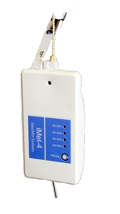&nbsp;
             
            &nbsp;&nbsp;&nbsp;&nbsp; &nbsp; &nbsp;&nbsp; Intermet I-Met
            4
            &nbsp;&nbsp;&nbsp;&nbsp;&nbsp;&nbsp;&nbsp;&nbsp;&nbsp;&nbsp;&nbsp;&nbsp;
             
          

          
 
            <b>Install Gqrx, 3 options:</b>

          
sudo apt-get
            install gqrx 
            <b>You get an old Gqrx version in Ubuntu 16.04 and no
              updates.</b> 
          

          
  
          

          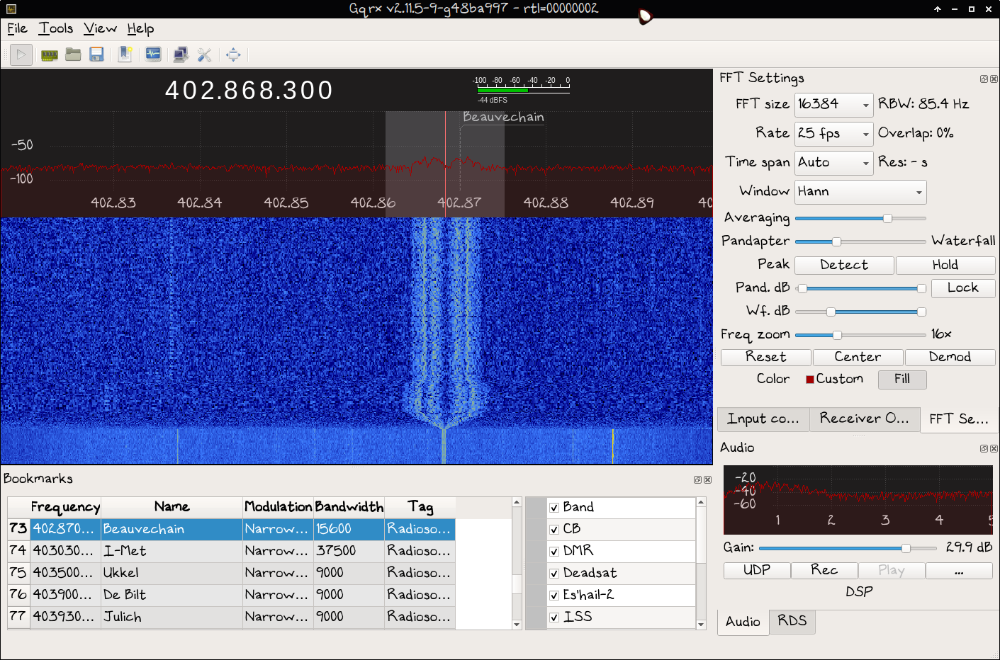 
           
          
Follow&nbsp;<a
              href="http://gqrx.dk/download/install-ubuntu"
              target="_blank">Install Gqrx SDR on Ubuntu Linux</a>&nbsp;and
            add PPA for install.

          
Or fast way
            (without GNU Radio setup) Download&nbsp;<a
              href="https://github.com/csete/gqrx/releases"
              target="_blank">Gqrx Appimage</a>: 
            chmod a+x Gqrx-2.11.5-x86_64.AppImage 
            And run,

          
./Gqrx-2.11.5-x86_64.AppImage

          
 
          

          
CubicSDR, build
            from source or use&nbsp;<a
              href="https://github.com/cjcliffe/CubicSDR/releases/"
              target="_blank">Appimage</a> 
            chmod a+x CubicSDR-0.2.5-x86_64.AppImage 
            And run,

          
./CubicSDR-0.2.5-x86_64.AppImage

          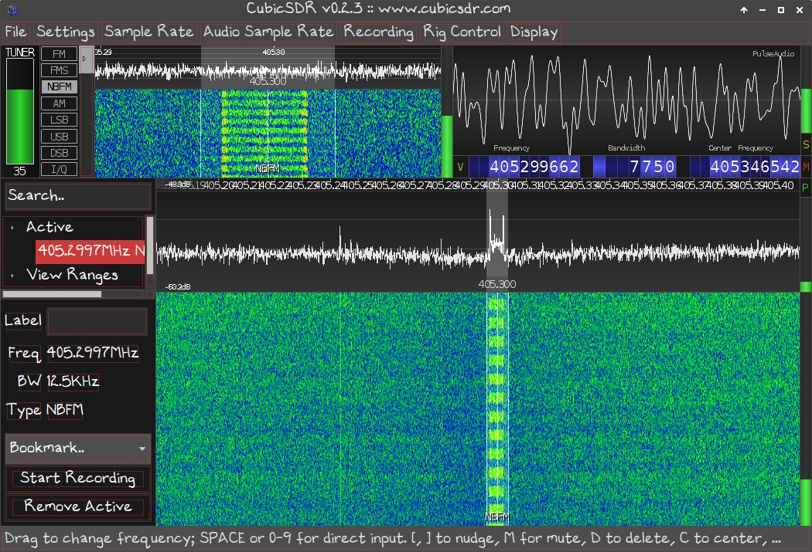 
           
          <h2>Virtual Audio setup 
          </h2>
          
&nbsp;&nbsp;&nbsp;&nbsp;&nbsp;&nbsp;&nbsp;
             
            &nbsp;&nbsp;&nbsp;&nbsp;&nbsp;&nbsp;&nbsp;&nbsp;&nbsp;&nbsp;&nbsp;&nbsp;&nbsp;&nbsp;&nbsp;&nbsp;&nbsp;&nbsp;&nbsp;&nbsp;&nbsp;
             
            &nbsp; &nbsp; &nbsp; &nbsp; &nbsp; &nbsp; &nbsp; &nbsp;
            &nbsp; &nbsp; &nbsp;&nbsp;&nbsp; Graw DFM-09
            &nbsp;&nbsp;&nbsp;&nbsp;&nbsp;&nbsp;&nbsp;&nbsp;&nbsp;&nbsp;&nbsp;&nbsp;&nbsp;&nbsp;&nbsp;
             
          

           
          <b>Some virtual audio can be setup: </b>
          
Adding these lines to this file ~/.config/pulse/default.pa
            on Ubuntu 16.04, newer distro's have to change
            /etc/pulse/default.pa:

          
load-module module-null-sink sink_name=VBCable_A
            sink_properties=device.description="VBCable_A" 
            load-module module-null-sink sink_name=VBCable_B
            sink_properties=device.description="VBCable_B" 

          
 
          

          
Will always load the desired NULL sinks on starting the
            pulseaudio sound server. 
            Removing sinks that had been loaded by pactl or pacmd, i.e.
            without settings in our default.pa can most quickly done by<b>
              pulseaudio -k</b> 
          

          
This command will kill the running pulseaudio instance, to
            instantaneaously respawn it (in a default set up) using
            values defined in the default.pa.  
            Start SDR App tune in on WX-Station that launches DFM/RS or
            any Radiosonde you prefer.

          
 
            It is recommend disabling PulseAudio logging, as this seems
            to be a large user of CPU cycles. 
             
            Edit /etc/pulse/daemon.conf 
            Now find "log-level" and change it to "log-level = error".  
            Remove the semi-colon on the log-level line too. Save and
            exit. 
             
            ; log-target = auto 
            log-level = error 
            ; log-meta = no 
            You can now reload pulseaudio either by rebooting, or
            running "pulseaudio -k" at a command line. 
             
          

          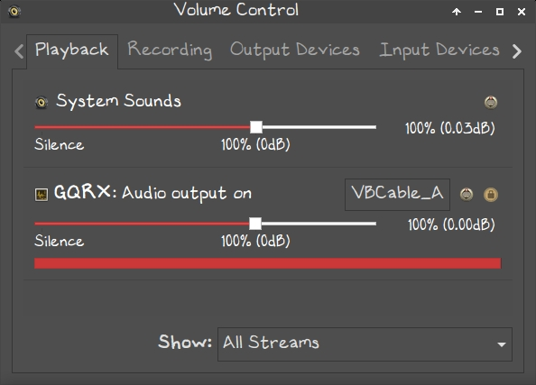 
           
          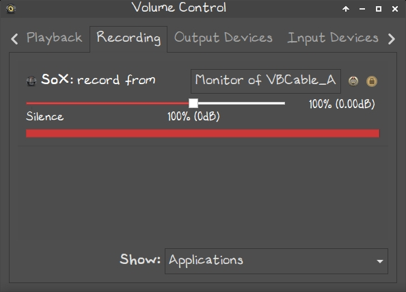 
           
          
<b>Dont forget PVAControl to setup the Virtual audio!</b>

          <h2>GPSD Setup 
          </h2>
          
&nbsp;&nbsp;&nbsp;&nbsp;&nbsp;&nbsp;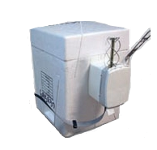&nbsp;
             
            &nbsp;&nbsp; &nbsp; &nbsp; &nbsp; &nbsp; &nbsp; Vaisala
            RS-92 Ozon
            &nbsp;&nbsp;&nbsp;&nbsp;&nbsp;&nbsp;&nbsp;&nbsp;&nbsp;&nbsp;&nbsp;&nbsp;&nbsp;&nbsp;&nbsp;&nbsp;&nbsp;
             
          

           
          In order to use gpsd with the decoder, we have to disable the
          service.
          
So it can be manually started:

          
sudo systemctl stop gpsd.socket 
            sudo systemctl disable gpsd.socket 

          
Should you ever want to enable the default gpsd systemd
            service you can run these commands to restore it:

          
sudo systemctl enable gpsd.socket 
            sudo systemctl start gpsd.socket  
             
          

          
Start script ./dfm_gps.sh or ./rs41_gps.sh

          
It will execute the script in 4 tabs terminals(vp and the
            chosen decoder). 
            The sleep commands are inserted so other processes(
            socat/gpsd) do not start before the decoder. 
          

           
          
It will create with socat 2 pairs of Virtual Com Ports, 1
            out other in, execute binary file. 
            NMEA data will be shown and the decoder. 
          

          
As long as the socat (Terminal
            vp) is running, you have a pair of VPs open.

          They are named virtualcom 0 and 1 so they stay static and no
          dev/pts/ number change.
          
 

          <h2>Get it all Running 
          </h2>
          
Need some GPS Applications to show Radiosonde position:

          
<b>sudo apt-get instal foxtrotgps</b> 
          

          
Will install older FoxtrotGPS version from feed. 
          

          
 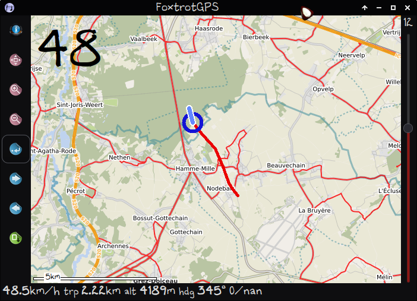 
             
          

          
<b>For newer versions build from source:</b> 
            Dependencies - <a
              href="https://www.foxtrotgps.org/build.html"
              target="_blank">https://www.foxtrotgps.org/build.html</a> 
            Download <a href="https://www.foxtrotgps.org/releases/"
              target="_blank">source</a> on FoxtrotGPS website. 
          

          
 &nbsp;

          
 <b>Insert extra Maps for FoxtrotGPS.</b> 
            Open FoxtrotGPS, goto Info Icon 3th screen, Map type's New: 
             
          

          
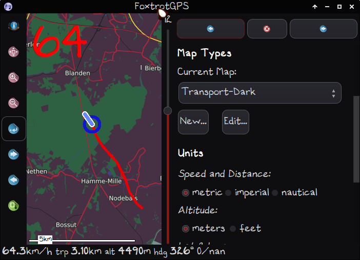 
             
          

          
 http://tile.memomaps.de/tilegen/%d/%d/%d.png 
             
          

          
 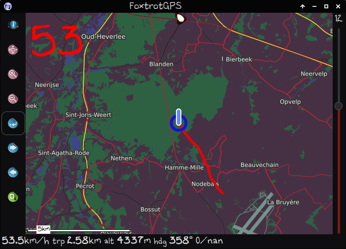

          
 
            For Thunderforest maps sign up free at their <a
              href="https://www.thunderforest.com/" target="_blank">website</a>
            to get api-key and insert it into the links below: 
             
          

          
 <b>Example</b>: 
          

          
thunderforest_api_key = 123

          https://tile.thunderforest.com/pioneer/%d/%d/%d.png?apikey=123 
          https://tile.thunderforest.com/cycle/%d/%d/%d.png?apikey=123 
https://tile.thunderforest.com/transport/%d/%d/%d.png?apikey=123 
https://tile.thunderforest.com/landscape/%d/%d/%d.png?apikey=123 
https://tile.thunderforest.com/outdoors/%d/%d/%d.png?apikey=123 
https://tile.thunderforest.com/transport-dark/%d/%d/%d.png?apikey=123 
https://tile.thunderforest.com/spinal-map/%d/%d/%d.png?apikey=123 
https://tile.thunderforest.com/neighbourhood/%d/%d/%d.png?apikey=123 
https://tile.thunderforest.com/mobile-atlas/%d/%d/%d.png?apikey=12 
           
          
<b>Install Navit.</b> 
            sudo apt-get install navit 
             
          

          
It's recommended to follow this excellent guide about
            navit: 
          

          
<a
              href="http://ozzmaker.com/navigating-navit-raspberry-pi/"
              target="_blank">http://ozzmaker.com/navigating-navit-raspberry-pi/</a>

          
Download Offline Navit OSM Map's: 
          

          
 <a href="http://maps3.navit-project.org/">http://maps3.navit-project.org/</a>
          

           
          Tune in on a Radiosonde, run scripts. 
           
          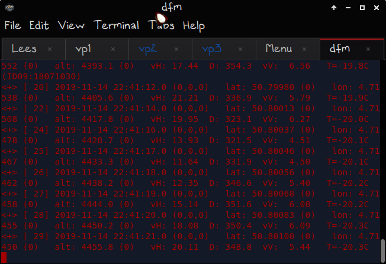 
          
Start FoxtrotGPS or Viking GPS to show Radiosonde current
            location and track. 
             
          

          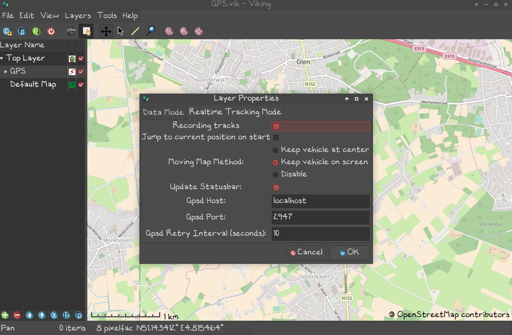 
           
          
Foxtrot gpsd-port: 2947

           
          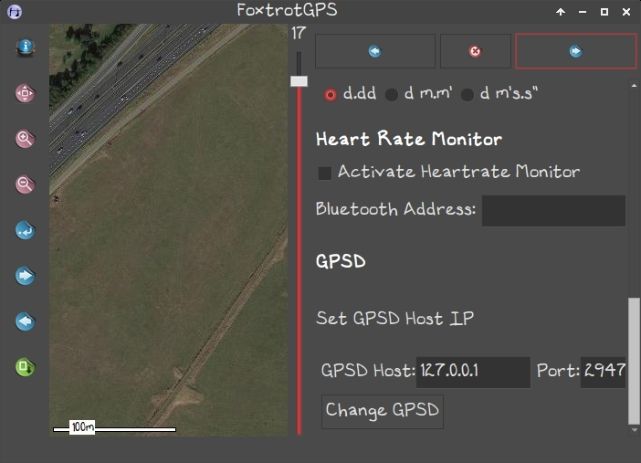 
           
           
          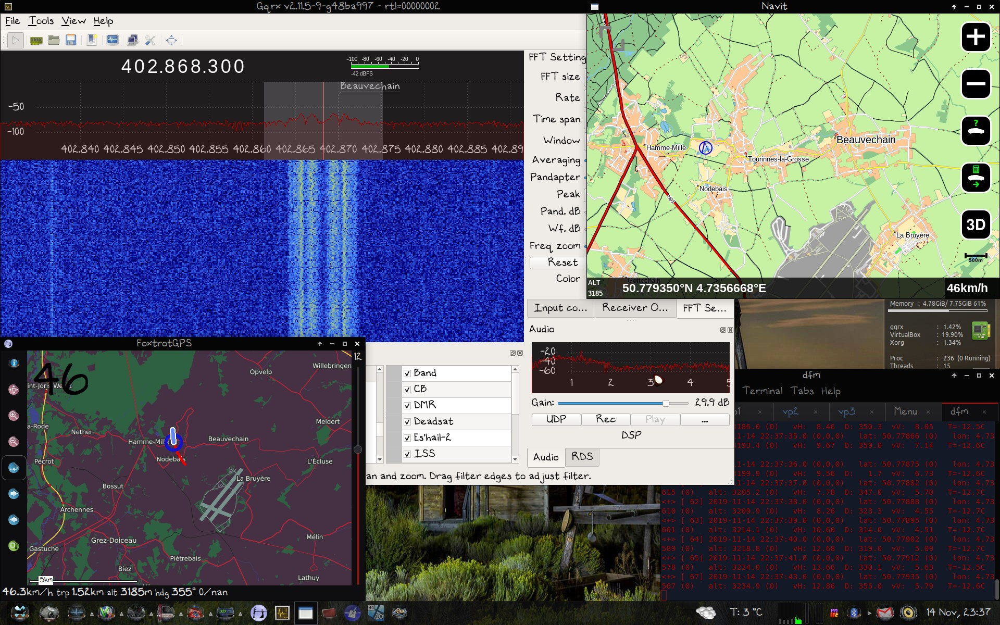 
           
        

        

          
Thanks fly out to Zilog80, Andreas6 and Flux242 for
            simplifying Virtual-ports. 
          

  </body>
</html>
